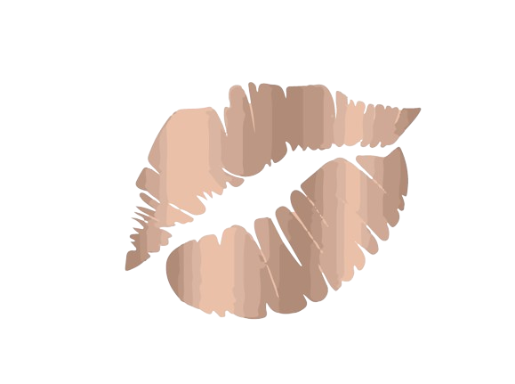
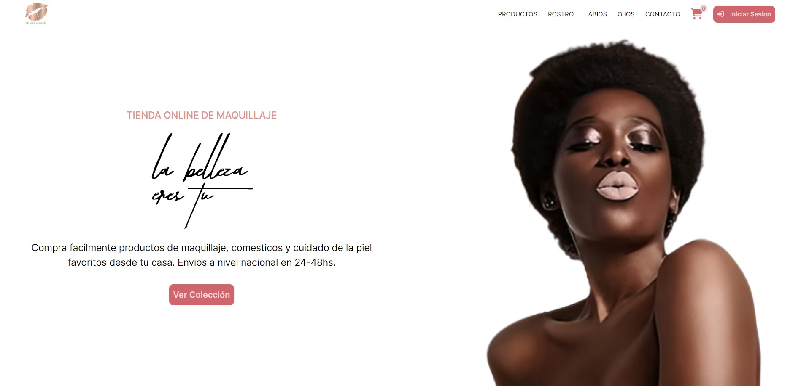
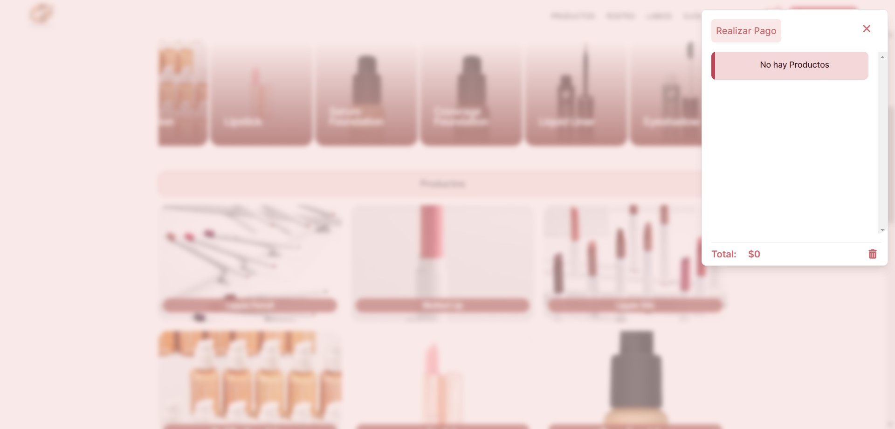
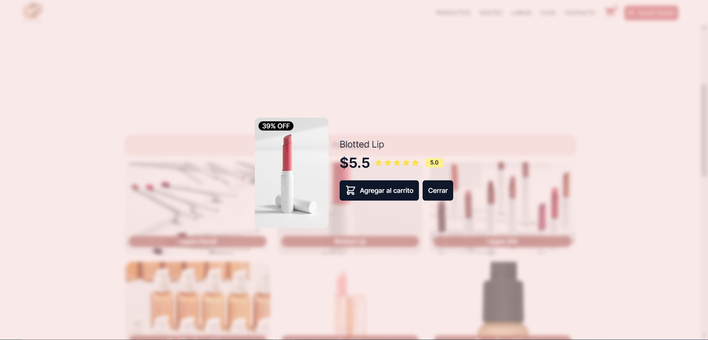
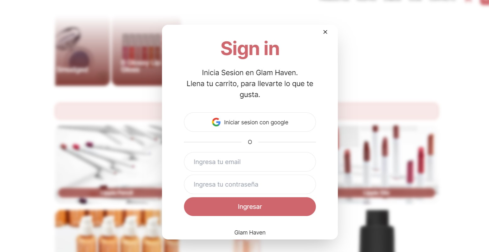

    

# Tienda de Maquillaje ECommerce - Glam Haven

## Descripción

La Tienda de Maquillaje ECommerce es una aplicación web que permite a los usuarios explorar y comprar una amplia variedad de productos de maquillaje. La aplicación utiliza tecnologías como HTML, JavaScript y Tailwind CSS para crear una experiencia de usuario atractiva y fácil de usar.

## Características Principales

- **Productos Recomendados**: La página principal muestra una selección de productos recomendados para que los usuarios puedan descubrir nuevas opciones de maquillaje.

- **Búsqueda y Filtrado**: Aun no se ha implentado

- **Carrito de Compras**: Los usuarios pueden agregar productos al carrito y ver un resumen de sus compras antes de proceder al pago.

- **Load Skeleton**: La aplicación utiliza Load Skeleton para mostrar un efecto visual mientras se cargan los productos, mejorando así la experiencia del usuario.

## Categorías Disponibles

La Tienda de Maquillaje ofrece una amplia variedad de categorías de productos, que incluyen:

- Maquillaje de Ojos
- Maquillaje de Labios
- Maquillaje de Rostro
- Accesorios de Maquillaje

## Capturas de Pantalla

### Página Principal

    

### Carrito de Compras

    

### Producto Seleccionado

    

### Iniciar Sesión

    

## Tecnologías Utilizadas

- **HTML**: Lenguaje de marcado utilizado para estructurar la aplicación web.
- **JavaScript**: Lenguaje de programación utilizado para agregar interactividad y funcionalidad a la aplicación.
- **Tailwind CSS**: Framework de CSS utilizado para diseñar y estilizar la interfaz de usuario de manera eficiente.

## API de Make Up

La Tienda de Maquillaje utiliza la API de Make Up para obtener información sobre los productos disponibles. Esta API proporciona datos detallados sobre una amplia gama de productos de maquillaje, incluyendo nombre, marca, precio y categoría.

## Instalación

No se requiere instalación adicional. La aplicación es accesible a través de un navegador web y puede ser utilizada de inmediato.

## Uso

1. Abre la aplicación en tu navegador web.
2. Explora los productos disponibles en la página principal.
3. Utiliza la barra de búsqueda y los filtros de categoría para encontrar productos específicos.
4. Agrega productos al carrito de compras y procede al pago cuando estés listo.

## Licencia

Este proyecto está bajo la Licencia MIT. Consulta el archivo [LICENSE](LICENSE) para más detalles.

## Colaborador

Nombre del Colaborador o Equipo
